### `piyush@github ~ $ ./contributions.sh`

  

### `piyush@github ~ $ whoami`

<table>
<tr>
<td valign="top" width="320"></td>
<td valign="top" width="540"></td>
</tr>
</table>

 

`Java` · `Spring Boot` · `MySQL` · `REST APIs` · `React` · `Node.js` · `Git` · `Docker`

 

### `piyush@github ~ $ status`

**Building full-stack systems. Learning continuously. Shipping things that work.**

